# Netflix Content Analysis

**What does Netflix offer, and how has its catalogue changed?** An exploratory analysis of 8,807 Netflix movies and TV shows using Python, with a 6-page interactive Power BI dashboard.

**Tools:** Python (pandas, NumPy, Matplotlib, SciPy) · Jupyter · Power BI (DAX, Power Query)

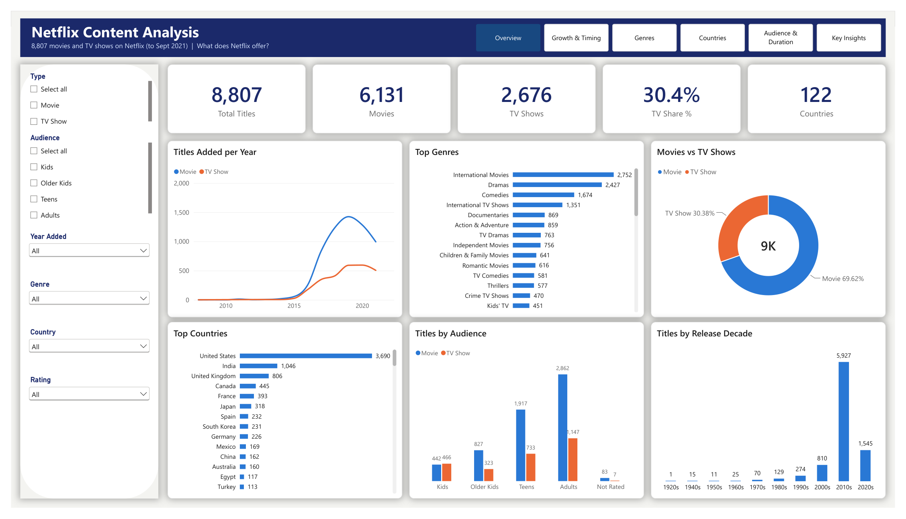

---

## Key findings

| # | Finding | Evidence |
|---|---|---|
| 1 | **The catalogue is mostly movies** | 70% movies, 30% TV shows |
| 2 | **Additions peaked in 2019** | 82 titles added in 2015 → 2,016 in 2019 |
| 3 | **TV shows are a growing share of new additions** | 25% of additions in 2018 → 34% in 2021 |
| 4 | **International content leads** | "International Movies" is the largest genre (2,752 titles) |
| 5 | **The US leads, India is second** | 3,690 vs 1,046 titles |
| 6 | **Countries specialise** | 92% of Indian titles are movies; 74% of South Korean titles are TV shows |
| 7 | **Mostly adult content** | 46% of titles are for adults; 10% for young kids |
| 8 | **Newer movies are shorter** | Median 96 min (released 2015+) vs 104 min (earlier); Mann-Whitney U test, p < 0.001 |
| 9 | **Most TV shows end after one season** | 67% have a single season |
| 10 | **Content arrives fast** | 37% of titles are added in the same year they are released |

## Dataset

- **Source:** [Netflix Movies and TV Shows](https://www.kaggle.com/datasets/shivamb/netflix-shows) (Kaggle, Shivam Bansal)
- **Size:** 8,807 titles × 12 columns, covering titles added up to September 2021

## Process

### 1. Data cleaning: [`notebooks/01_data_cleaning.ipynb`](notebooks/01_data_cleaning.ipynb)
- Checked for duplicates (none found)
- Fixed 3 rows where the duration had been typed into the `rating` column
- Filled missing `director` (2,634), `cast` (825) and `country` (831) with "Unknown" and added flags, instead of dropping a third of the data. 91% of TV shows have no director, because series are credited to creators
- Converted `date_added` from text to dates (88 values had a stray leading space)
- Split `duration` into `movie_minutes` and `tv_seasons`
- Grouped 14 ratings (TV-MA, R, PG-13…) into audiences: Kids, Older Kids, Teens, Adults
- Built one-row-per-value tables for genres (42) and countries (123), since a title can have several

### 2. Exploratory analysis: [`notebooks/02_eda.ipynb`](notebooks/02_eda.ipynb)
Six questions, each answered with a chart and a written finding, plus a Mann-Whitney U test to check whether newer movies are really shorter.

### 3. Power BI dashboard: [`dashboard/netflix_dashboard.pbip`](dashboard)
A data model with a `Titles` fact table, genre and country bridge tables (one title can have several of each, so they filter in both directions) and an audience lookup table, plus 21 DAX measures, for example:

```DAX
TV Share % = DIVIDE ( [TV Shows] + 0, [Total Titles] )

Same-Year Share % =
DIVIDE (
    CALCULATE ( [Total Titles], Titles[years_to_netflix] = 0 ),
    CALCULATE ( [Total Titles], NOT ISBLANK ( Titles[years_to_netflix] ) )
)
```

| Page | Question it answers |
|---|---|
| Overview | What does Netflix offer? |
| Growth & Timing | How fast did the catalogue grow, and how quickly does content arrive? |
| Genres | Which genres dominate, for movies and TV? |
| Countries | Where does content come from, and what kind? |
| Audience & Duration | Who is it for, and how long are movies and series? |
| Key Insights | Six findings and notes on the data |

Every page has slicers for type, audience, year added, genre, country and rating. A PDF of all pages is in [`dashboard/netflix_dashboard.pdf`](dashboard/netflix_dashboard.pdf).

| | |
|---|---|
| 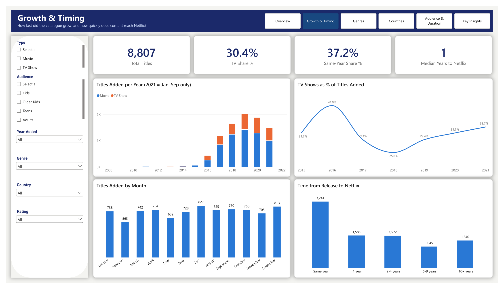 | 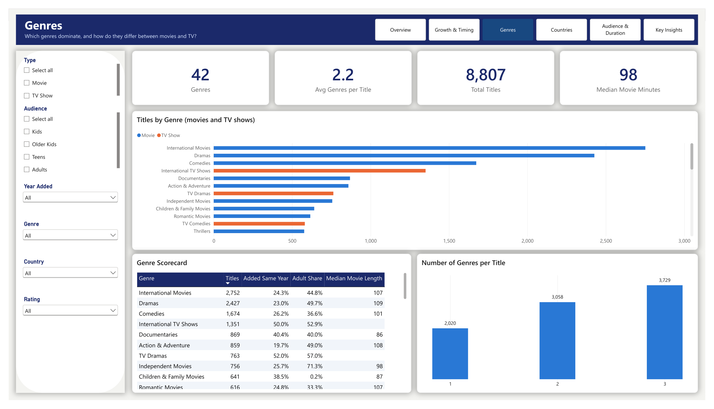 |
| 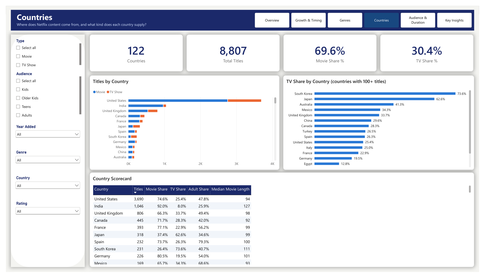 | 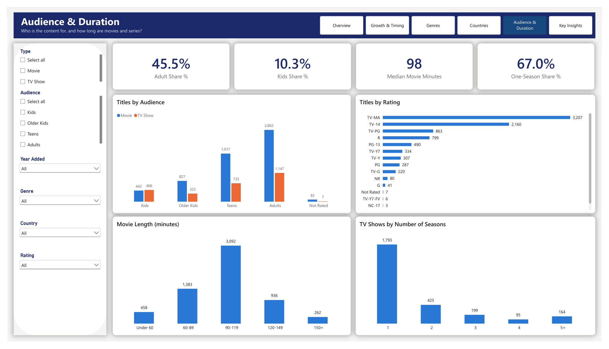 |

## Charts (Python)

| | |
|---|---|
| 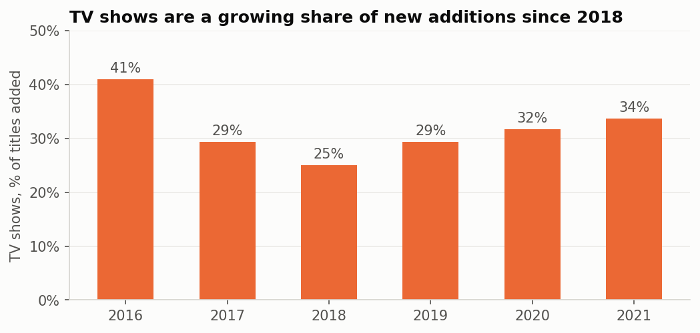 | 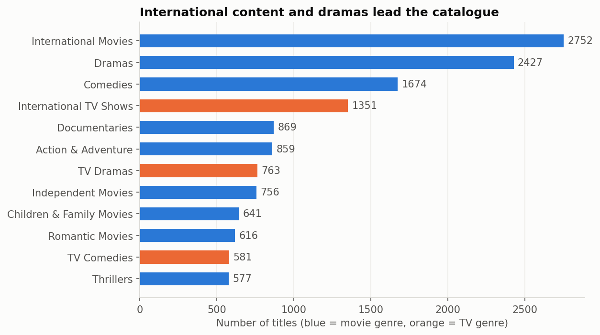 |
| 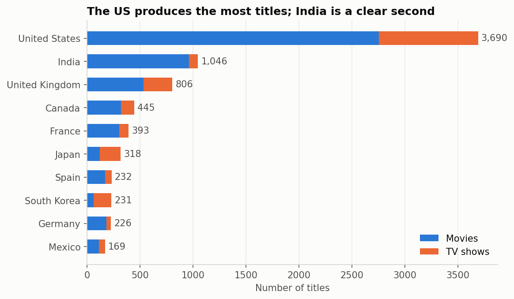 | 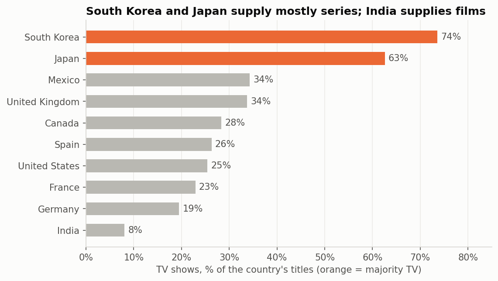 |
| 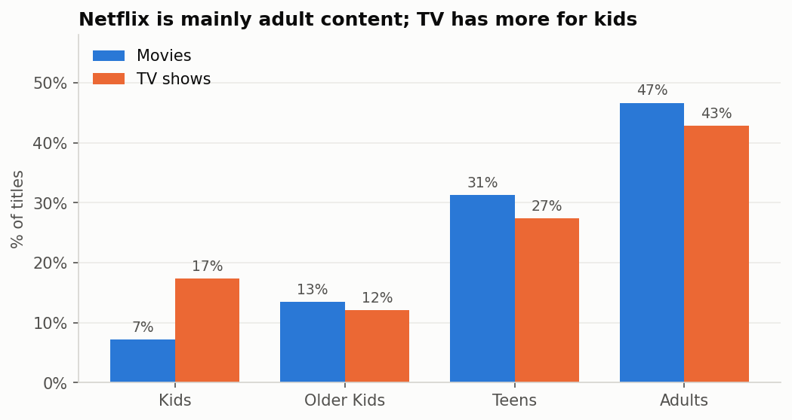 | 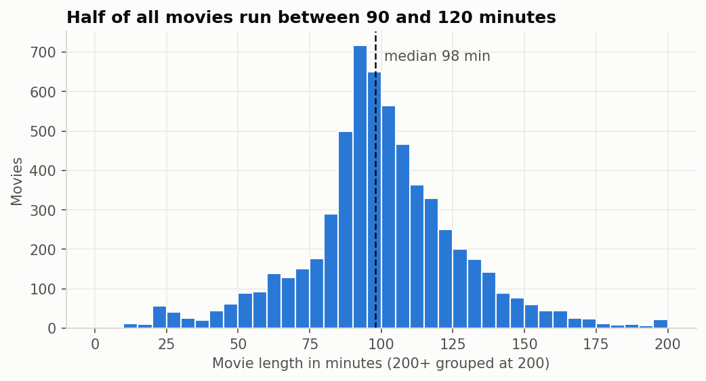 |
| 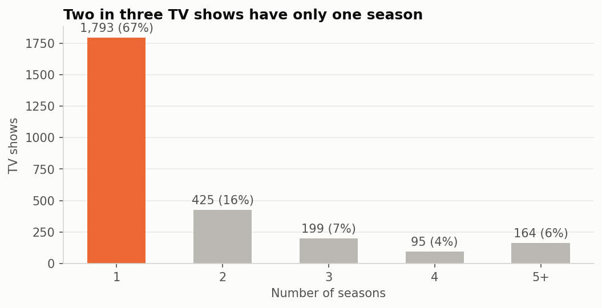 | 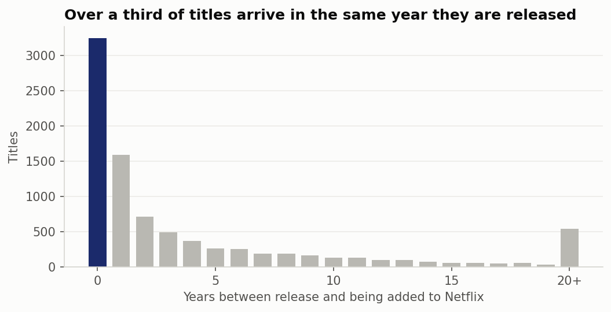 |

## Limitations

- A snapshot up to September 2021, so 2021 is a partial year
- Director, cast and country are missing for some titles
- The data shows what is available on Netflix, not what people watch

## Project structure

```
netflix-content-analysis/
├── data/
│   ├── raw/              netflix_titles.csv
│   └── processed/        cleaned data + genre and country tables
├── notebooks/
│   ├── 01_data_cleaning.ipynb
│   └── 02_eda.ipynb
├── dashboard/
│   ├── netflix_dashboard.pbip            open in Power BI Desktop
│   ├── netflix_dashboard.Report/         report pages
│   ├── netflix_dashboard.SemanticModel/  data model and DAX
│   └── netflix_dashboard.pdf
├── images/               Python charts and dashboard screenshots
└── requirements.txt
```

## How to run

1. `pip install -r requirements.txt`
2. Run `notebooks/01_data_cleaning.ipynb`, then `notebooks/02_eda.ipynb`
3. Open `dashboard/netflix_dashboard.pbip` in Power BI Desktop and click **Refresh**. The data paths point to `C:\Users\dell\Documents\netflix-content-analysis\data\processed\`; if your folder is different, update them in **Transform data → Advanced Editor**.

## Author

**Aditya Kale**: [LinkedIn](https://www.linkedin.com/in/adityak0012) · [GitHub](https://github.com/Adityak0012) · [Kaggle](https://www.kaggle.com/adityak321)
